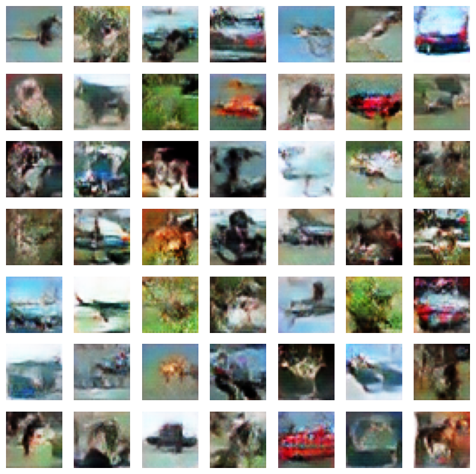

# A Case for Conditioning

 
|  | 
|:--:| 
| Sample of images produced by the transposed convolutional GAN trained on the CIFAR-10 dataset |
## Context

In this repository you will find various materials associated with the semester long research project for CAP6610. In this project I wanted to examine if the conditional variations of the GAN and VAE were superior to their unconditional counterparts. I also wanted to see if the upscaling convolution was actually better than the transposed convolution. 

To validate this I trained 8 models on the CIFAR-10 dataset: 4 Unconditioned GANs and VAEs with some consisting of uspcaling convolutions and others of transposed convolutions and 4 of the same GANs and VAEs but conditioned. To validate the results of this I utilized FID and IS.

It was found that the conditional variations of the VAE were significantly better than their non-conditioned counterparts but for GANs, it seemed conditioning made it worse. More research will need to be done to determine the cause of this but this offers a unique insight into the power of conditioning generative models.

## Structure

This repository is divided into four major folders:

- Images 
- models
- Notebooks
- Reports

You can find some sample output of each model in `images`, the trained weights of each model under `models`, and the notebooks used to train and evaluate the models under `Notebooks`. `Reports` as the name states contains all the reports I wrote and developed this semester for the project.

## References

The following resources were used as a starting point and were heavily modified for my uses and experiments.

https://keras.io/examples/generative/conditional_gan/
https://keras.io/examples/generative/vae/
https://keras.io/examples/generative/dcgan_overriding_train_step/
https://www.tensorflow.org/tutorials/generative/cvae